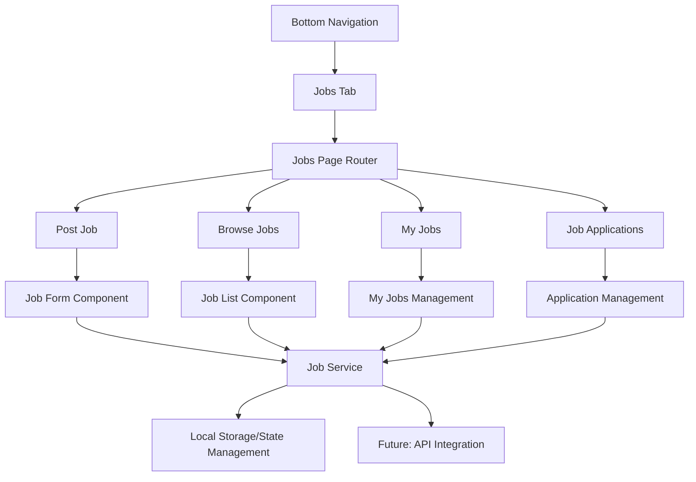

# Design Document

## Overview

This design document outlines the implementation of a job posting and management system integrated into the existing farming application's bottom navigation. The solution will add a new "Jobs" tab to the bottom navigation, providing farmers with the ability to post labor opportunities and job seekers to find agricultural work.

The design leverages the existing React Router structure, shadcn/ui components, and mobile-first approach while maintaining consistency with the current application's design patterns and user experience.

## Architecture

### High-Level Architecture



### Navigation Integration

The jobs feature will be integrated into the existing bottom navigation by:
1. Adding a new "Jobs" tab with a briefcase icon
2. Expanding the current 4-tab layout to 5 tabs
3. Maintaining the existing navigation patterns and styling
4. Using React Router for page navigation within the jobs section

### State Management Strategy

Given the current project structure uses React Query for data fetching and local state management:
- **Local State**: React useState/useReducer for form state and UI interactions
- **Persistent Storage**: localStorage for job data persistence (Phase 1)
- **Future Enhancement**: React Query integration for API calls when backend is available

## Components and Interfaces

### Core Components

#### 1. JobsPage Component
- **Purpose**: Main container for job-related functionality
- **Location**: `src/pages/Jobs.tsx`
- **Features**: Tab-based navigation between Post Job, Browse Jobs, My Jobs, and Applications

#### 2. PostJobForm Component
- **Purpose**: Form for creating new job postings
- **Location**: `src/components/jobs/PostJobForm.tsx`
- **Features**: Multi-step form with validation, job details input, preview functionality

#### 3. JobCard Component
- **Purpose**: Reusable card component for displaying job information
- **Location**: `src/components/jobs/JobCard.tsx`
- **Features**: Job summary, action buttons, status indicators

#### 4. JobList Component
- **Purpose**: List container with filtering and search capabilities
- **Location**: `src/components/jobs/JobList.tsx`
- **Features**: Search, filter by location/type/pay, pagination

#### 5. JobDetails Component
- **Purpose**: Detailed view of a specific job posting
- **Location**: `src/components/jobs/JobDetails.tsx`
- **Features**: Full job information, application functionality, contact details

#### 6. ApplicationForm Component
- **Purpose**: Form for applying to jobs
- **Location**: `src/components/jobs/ApplicationForm.tsx`
- **Features**: Applicant information, cover message, contact details

### Navigation Updates

#### Updated BottomNavigation Component
```typescript
const navItems = [
  { label: "Home", icon: Home, path: "/" },
  { label: "Prices", icon: TrendingUp, path: "/price-prediction" },
  { label: "Jobs", icon: Briefcase, path: "/jobs" }, // New item
  { label: "Calendar", icon: Calendar, path: "/crop-calendar" },
  { label: "Calculator", icon: Calculator, path: "/fertilizer-calculator" },
];
```

#### Router Updates
New routes will be added to the main App.tsx router:
- `/jobs` - Main jobs page with tabs
- `/jobs/post` - Direct link to post job form
- `/jobs/browse` - Direct link to browse jobs
- `/jobs/my-jobs` - User's posted jobs
- `/jobs/applications` - Job applications management

## Data Models

### Job Interface
```typescript
interface Job {
  id: string;
  title: string;
  description: string;
  location: {
    address: string;
    coordinates?: {
      lat: number;
      lng: number;
    };
  };
  jobType: 'full-time' | 'part-time' | 'seasonal' | 'contract';
  category: 'planting' | 'harvesting' | 'irrigation' | 'livestock' | 'maintenance' | 'other';
  payRate: {
    amount: number;
    type: 'hourly' | 'daily' | 'weekly' | 'project';
    currency: string;
  };
  duration: {
    startDate: Date;
    endDate?: Date;
    estimatedHours?: number;
  };
  requirements: string[];
  benefits?: string[];
  contactInfo: {
    name: string;
    phone: string;
    email?: string;
    preferredContact: 'phone' | 'email';
  };
  postedBy: string; // User ID
  postedAt: Date;
  status: 'active' | 'filled' | 'expired' | 'cancelled';
  applicationsCount: number;
}
```

### JobApplication Interface
```typescript
interface JobApplication {
  id: string;
  jobId: string;
  applicantName: string;
  applicantPhone: string;
  applicantEmail?: string;
  coverMessage: string;
  experience: string;
  availability: {
    startDate: Date;
    endDate?: Date;
  };
  appliedAt: Date;
  status: 'pending' | 'reviewed' | 'accepted' | 'rejected';
}
```

### User Profile Extension
```typescript
interface UserProfile {
  id: string;
  name: string;
  phone: string;
  email?: string;
  userType: 'employer' | 'job-seeker' | 'both';
  location?: string;
  // Existing profile fields...
}
```

## Error Handling

### Form Validation
- **Client-side validation**: Using react-hook-form with zod schema validation
- **Real-time feedback**: Field-level validation with immediate error display
- **Accessibility**: ARIA labels and error announcements for screen readers

### Error Boundaries
- **Component-level**: Error boundaries around job-related components
- **Graceful degradation**: Fallback UI when components fail to load
- **Error reporting**: Console logging for debugging (future: error tracking service)

### Network Error Handling
- **Offline support**: localStorage fallback when network is unavailable
- **Retry mechanisms**: Automatic retry for failed operations
- **User feedback**: Toast notifications for success/error states

## Testing Strategy

### Unit Testing
- **Components**: Test individual components with React Testing Library
- **Utilities**: Test helper functions and data transformation logic
- **Hooks**: Test custom hooks with @testing-library/react-hooks

### Integration Testing
- **User flows**: Test complete user journeys (post job → browse → apply)
- **Navigation**: Test routing and navigation between job-related pages
- **Form submissions**: Test form validation and submission processes

### Mobile Testing
- **Responsive design**: Test on various screen sizes and orientations
- **Touch interactions**: Test tap, swipe, and scroll gestures
- **Performance**: Test loading times and smooth animations

### Accessibility Testing
- **Screen readers**: Test with NVDA/JAWS screen reader compatibility
- **Keyboard navigation**: Test full keyboard accessibility
- **Color contrast**: Ensure WCAG 2.1 AA compliance
- **Focus management**: Test focus indicators and tab order

## Mobile Optimization

### Responsive Design
- **Mobile-first approach**: Design for mobile screens first, then scale up
- **Touch-friendly**: Minimum 44px touch targets for buttons and interactive elements
- **Thumb-friendly navigation**: Important actions within thumb reach zones

### Performance Considerations
- **Lazy loading**: Load job images and non-critical content on demand
- **Virtual scrolling**: For large job lists to maintain smooth performance
- **Optimized images**: Compressed images with appropriate sizing

### Capacitor Integration
- **Native features**: Leverage device capabilities (GPS for location, camera for photos)
- **Push notifications**: Future enhancement for job alerts and application updates
- **Offline functionality**: Cache critical data for offline access

## Implementation Phases

### Phase 1: Core Functionality
1. Update bottom navigation with Jobs tab
2. Create basic job posting form
3. Implement job browsing with basic filtering
4. Add localStorage persistence
5. Basic responsive design

### Phase 2: Enhanced Features
1. Advanced filtering and search
2. Job application system
3. My Jobs management interface
4. Enhanced mobile optimizations
5. Accessibility improvements

### Phase 3: Advanced Features
1. Location-based job matching
2. Push notifications
3. Photo uploads for job postings
4. Advanced analytics and reporting
5. API integration preparation

## Security Considerations

### Data Privacy
- **Local storage encryption**: Sensitive data encrypted before localStorage
- **PII handling**: Minimal collection and secure handling of personal information
- **User consent**: Clear privacy policy and consent mechanisms

### Input Validation
- **XSS prevention**: Sanitize all user inputs
- **SQL injection**: Prepared statements when API is implemented
- **Rate limiting**: Prevent spam job postings and applications

### Authentication
- **User verification**: Phone number verification for job posters
- **Session management**: Secure session handling
- **Role-based access**: Different permissions for employers vs job seekers